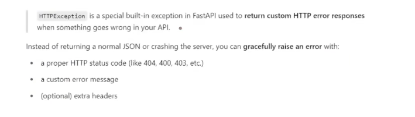

# Path

- The `Path()` function in FastAPI is used to provide `metadata`, `validation`, `rules` and `documentation` hints for path parameters in your API endpoints.

        Title
        Description
        Example
        ge, gt, le, It
        Min_length
        Max_length
        regex

# HTTP Status Code

  

  

  

  

# Query Parameter 
